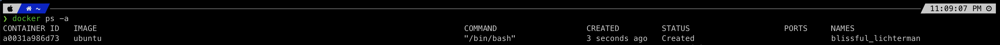

## 1. Docker 주요 구성 요소

### Docker Engine
- Docker는 클라이언트/서버 구조로 이루어진다.
  - 서버는 Docker Daemon Process(데몬 프로세스) 형태로 동작한다. (즉, 계속 실행됨)
  - Docker Command는 일종의 클라이언트라고 이해하면 된다.
- 클라이언트인 Docker Command에서 Docker Daemon Process(서버)에 요청을 하기 위해선 프로세스 간 통신 기법이 필요한데, Docker는 이를 위해 Rest API를 사용한다.
  - 즉, Docker Command를 명령하면, 내부적으로 Rest API를 사용해서 Docker Daemon Process를 호출한다.
  - (예) `docker ps`라고 명령하면, 내부적으로 마치 다음 명령처럼 Rest API를 호출한다.
    - http GET 'docker daemon process'/api-version/containers

### Docker Image
- Docker 컨테이너를 생성하기 위한 명령들이 작성된 템플릿이다.
- 일반적으로 여러 이미지들을 Layer로 쌓아서 원하는 형태의 이미지를 만든다.
  - (예) ubuntu 이미지에 apache 웹서버 이미지를 쌓아서, 웹서버 이미지를 만든다.

### Docker Container
- Docker Image가 리눅스 컨테이너 형태로 실행된 상태(instance)를 의미한다.
- Docker Daemon에 있는 커널에서 리눅스 컨테이너(LXC)를 생성한 후, 해당 컨테이너에 Docker Image의 명령을 실행하여 Docker Container를 만들고 컨테이너를 실행한다.
- Docker Container는 분리된 독립적인 공간으로, Docker Daemon Process를 통해 접속할 수도 있고, 컨테이너 내부에 들어가서 코드 수정 및 재실행 등도 할 수 있다.


## 2. Docker Image 주요 명령
- 모든 Docekr 명령은 CLI(Command Line Interface)로 키보드롤 직접 명령을 작성해서 실행하며, 명령은 보통 다음과 같은 형태를 가진다.
```bash
docker 명령 옵션 선택자(이미지ID/컨테이너 등)
```

- docker는 image와 container 명령이 각각 별도로 존재한다.
- image를 다루는지, container를 다루는지 명시적으로 나타내기 위해, docker 다음에 image 또는 container를 기재해준다.
  - 참고로 image와 container의 명령어는 서로 다르기 때문에 굳이 image, container를 붙이지 않아도 명령은 실행된다.
```bash
docker image 명령 옵션 ...
docker container 명령 옵션 ...
```

> Docker를 통한 작업 크게 다음과 같은 과정을 거친다.
> 1. Docker 설치
> 2. docker image 다운로드
> 3. 다운 받은 image로 docker container 생성 및 실행
>
> 아래에서는 <b>2.docker image 다운로드</b> 과정을 소개한다.

### 1. Docker Hub에서 다운받을 이미지 검색
- Docker 이미지를 직접 작성해서 사용할 수도 있지만, 이미 잘 작성된 이미지를 다운로드 받아서 사용할 수 있다.
  - https://hub.docker.com

```bash
docker search 이미지명[:태그]
```
- 태그는 보통 이미지의 버전 정보를 넣는다.
  - 태그를 넎지 않으면 최신 버전의 이미지를 의미하게 된다.
  - 따라서 태그를 붙이지 않으면, 다운로드 받은 이미지의 태그는 latest가 된다.

```bash
docker search ubuntu
```
- ubuntu 이미지를 검색하면 다양한 이미지 리스트를 볼 수 있다.
  - 이 중 OFFICIAL 항목이 [OK] 라고 적힌 이미지가 공식 이미지이다.
  - nuagebec/ubuntu 같이 / 가 있는 경우, / 앞의 문자열은 Docker Hub 사용자명으로 해당 사용자가 만든 이미지라고 보면 된다. (즉, 공식 이미지가 아님)
- `--limit` 옵션을 넣어 검색할 리스트 개수를 제한할 수 있다.
```bash
docker search --limit=5 ubuntu
```

### 2. 이미지 다운로드
```bash
docker pull ubuntu # 최신 버전 다운로드
docker pull ubuntu:22.10 # 특정 버전 다운로드
```
- `docker pull` 명령은 이미지를 다루는 명령이므로, `docker image pull`로 쓸 수 있다.

### 3. 다운로드 받은 이미지 목록 확인
```bash
 # 이미지 목록 출력
docker images
docker image ls

# 이미지 ID만 출력
docker images -q 
docker image ls -q
```

### 4. 다운로드 받은 이미지 삭제
```bash
docker rmi 이미지ID(또는 이미지 REPOSITORY 이름)
docker image rm 이미지ID(또는 이미지 REPOSITORY 이름)
```


## 3. Docker Container 주요 명령
### 1. 컨테이너 생성
- 이미지는 컨테이너로 만들어줘야 실행 가능하다.
- 이미지와 컨테이너는 각각 관리해줘야 한다.
```bash
docker create ubuntu

# 컨테이너 이름 설정
docker create --name myubuntu ubuntu
```
- 위 명령으로 컨테이너 생성 시, docker 프로그램에서 컨테이너에 이름을 자동 부여한다.

### 2. 생성된 컨테이너 확인
```bash
# 현재 실행중인 컨테이너 확인
docker ps

# 전체 컨테이너 확인
docker ps -a

# 전체 컨테이너의 ID만 출력
docker ps -a -q
```




|항목|설명|
|---|---|
|CONTAINER ID|컨테이너 ID|
|IMAGE|이미지 이름|
|COMMAND|컨테이너 실행 시 실행되는 프로세스 이름|
|CREATED|컨테이너 생성 후 경과 시간|
|STATUS|컨테이너 실행 상태 (Created: 생성, Up: 실행중, Pause: 중지, Exited: 종료)|
|PORTS|Host와 컨테이너 포트 사이 연결 관계|
|NAMES|컨테이너 이름|

- 각 이미지마다 컨테이너 생성 시 실행할 프로세스를 기재할 수 있으며, 이를 COMMAND 항목에서 확인할 수 있다.
- ubuntu의 경우 bash 쉘 프로그램이 실행된다. (`/bin/bash`)

### 3. 컨테이너 삭제
```bash
docker rm 컨테이너이름(NAMES 항목에 있는 이름, 또는 컨테이너 ID)
```

### 4. 컨테이너 실행
```bash
docker start 컨테이너이름
```
- ubuntu 컨테이너를 `start` 명령어로 실행하면 바로 중지된다.
- 이유
  - 컨테이너는 생성 시 실행하도록 설정된 응용 프로그램의 실행이 끝나면 중지된다.
  - ubuntu 컨테이너 생성 시 실행되는 bash 쉘 프로그램은, 터미널을 통해 키보드 입력을 표준 입력(STDIN)으로 받을 수 있는 상태여야 대기 상태로 계속 실행되며, 그렇지 않은 경우 종료된다.
  - 따라서 단순히 `start` 명령어로 별도 터미널 및 표준 입력 연결 설정 없이 ubuntu 컨테이터를 실행하면, 쉘 프로그램이 종료되고 이에 따라 컨테이너도 바로 중지 상태가 된다.
  - 강의자료 01_docker_start p.11 참고

### 5. docker run 명령
- docker run 명령어는 이미지를 다운로드 받고 컨테이너를 생성 및 실행해준다. (run = pull + create + start)

#### [docker run 주요 옵션]
|옵션|설명|
|---|---|
|-i|컨테이너 입력(STDIN)을 열어두는 옵션 (주로 -t 옵션과 같이 사용함)|
|-t|가상 터미널(tty)를 할당하는 옵션 (주로 -i 옵션과 같이 사용함)|
|--name|컨테이너 이름을 설정하는 옵션|
|-d|컨테이너를 백그라운드에서 실행하는 옵션|
|--rm|컨테이너 종료 시 컨테이너를 자동 삭제하는 옵션|
|-p|호스트 PC와 컨테이너의 포트를 연결하는 옵션|
|-v|호스트 PC와 컨테이너의 디렉토리를 연결하는 옵션|

- -it 옵션 의미
  - -i 옵션은 표준 입력을 열어두어, 컨테이너가 실행되는 동안 터미널의 입력을 받을 수 있게 한다.
  - -t 옵션은 pseudo tty를 만들어, 표준 입력을 해당 가상 tty에 연결한다.
  - 이를 통해, 터미널에서 입력한 내용이 컨테이너 내의 프로그램으로 전달된다.
- (참고) pseudo tty
  - tty(teletypewriter)는 리눅스에서 콘솔 또는 터미널을 지칭한다.
  - tty를 통해 리눅스에 키보드 입력을 전달할 수 있으며, 하나 이상의 tty를 지원하기 위해 두 번째 tty부터 pseudo tty(가상 tty)가 사용된다.
 
```bash
docker run -it ubuntu

# 컨테이너 이름 설정
docker run -it --name myubuntu ubuntu
```
- ubuntu 자체만 컨테이너로 만들 경우 -it 옵션을 추가해주어야, ubuntu 컨테이너의 bash 쉘이 입력을 받을 수 있는 상태가 되어 컨테이너가 종료되지 않고 실행중인 상태가 된다.
- exit 명령으로 종료 시, 컨테이너는 중지(종료)된다.

```bash
# 컨테이너 종료 시 컨테이너 삭제 (exit 명령으로 종료 시, 컨테이너는 삭제된다.)
docker run -it --rm --name myubuntu ubuntu

# 컨테이너 프로세스를 백그라운드로 실행
docker run -it -d --name myubuntu ubuntu
```

### 6. 실행중인 컨테이너 종료
```bash
docker stop 컨테이너이름
```
- 중지한 컨테이너는 `docker start` 명령으로 재실행 가능하다.
- 실행중인 컨테이너를 잠깐 멈추는 명령은 `docker pause`이며, `docker unpause` 명령으로 실행이 가능하다.
